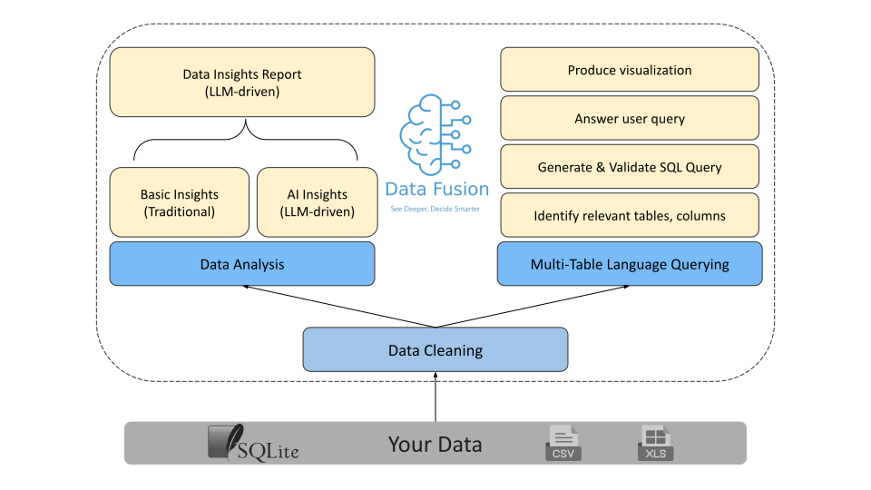

  

  

    <!--   -->
    <a href="https://data-fusion-umber.vercel.app/login">Website</a>
    ·
    <a href="./docs">Docs</a>
  

----------------------------------------
**DataFusion** is an innovative AI-powered platform that transforms how businesses interact with and manage data. It offers a full-fledged web framework to manage your data, use natural language querying and visualization, and enables interactions across multiple data sources.

  

## 🛠️ Features

1. **Easy grouping** of similar data sources (Projects and Active Projects)
2. **Language Query** for intuitive multi-table data exploration
3. **Generative interactive charts** for dynamic data visualization
4. **Automated data insights** and **data cleaning pipelines**
5. **Text-to-SQL** query options
6. **Voice-activated** chart explanations
7. Supports `csv`, `xls`, and `sqlite` file formats

## 🚀 Get Started

To get started:

1. Jump to the [project page](project/page/link) and create an account.
2. Create a project for your data source. For example: `Project E-Commerce`
3. Upload all the relevant data sources to the project. For example: `Customers.csv`, `Profits.csv`, `Orders.csv`, and `Products.csv`.
4. Load the project into **Active Projects**. This step will run two different pipelines: data cleaning and data analysis.
5. Once the active project is ready, open the `DataFusion Chat` window on the right.
6. Ask questions in plain English. For example: `How were mobile phone sales in the first quarter of 2024?` or `Plot a bar chart for mobile phone sales by month.`
7. Store the generated visualizations to the `Visualizer` page for later exploration. 

## 💡 Example Queries

## 📖 About us
We are a dedicated team of developers passionate about simplifying data analysis and visualization. 

Team members: 
- Akshay Pimpalkar
- Himesh Parashar
- Kiran Chawan
- Mamoon Jan

## 🤝 Citations
We would like to acknowledge the work of Dhruv Ateja for his project on Data Visualization. His strategy inspired us in developing the text-to-query methodology for this project.

